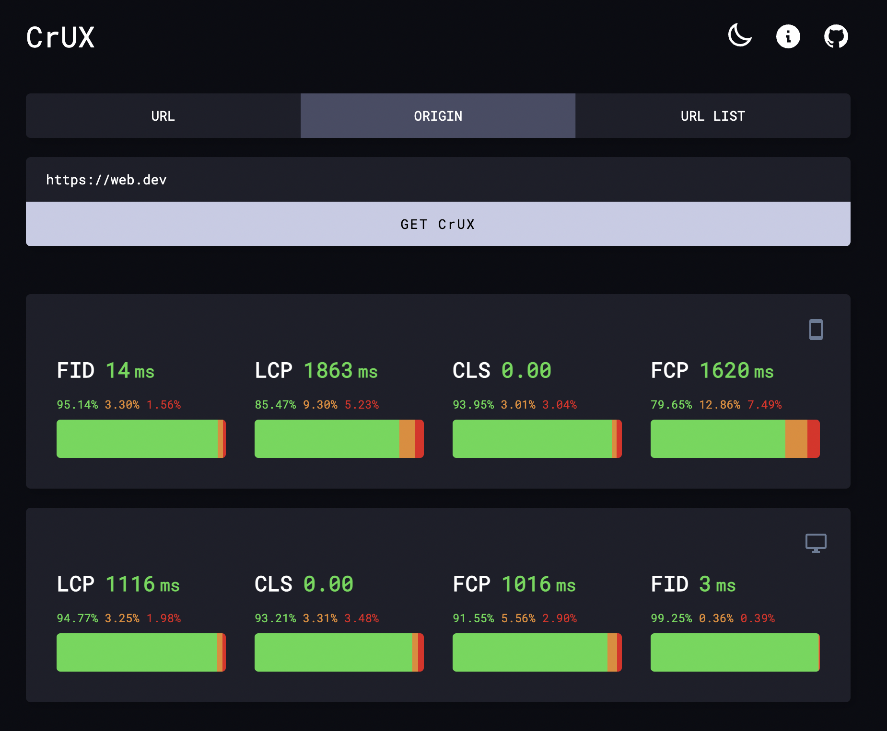

# crux.page

Get CrUX data for any webpage, origin or list of pages with ease.

### What is CrUX?

The Chrome User Experience Report (also known as the Chrome UX Report, or CrUX for short) is a dataset that reflects how real-world Chrome users experience popular destinations on the web. [Learn More](https://developer.chrome.com/docs/crux/about/)

 

## Check it out on: [crux.pages.dev](https://crux.pages.dev/)

 

### Tech Stack

- TypeScript
- Next.js
- React v18 ( with Suspense API )
- SWR
- CrUX API
- CloudFlare Workers ( proxies CrUX API, hides the API Key )
- CSS Modules ( SCSS )

Hosted on [CloudFlare Pages](https://pages.cloudflare.com/)
