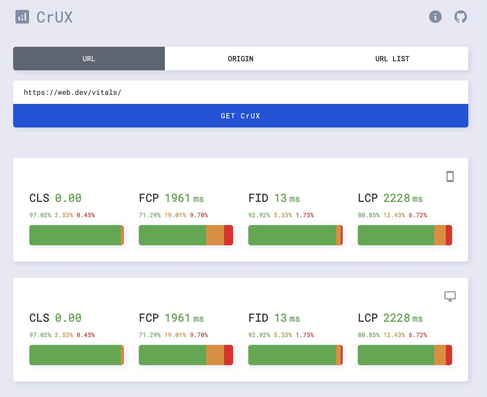

# CrUX app

Get CrUX data for any web page, origin or list of webpages with ease.

The Chrome User Experience Report (also known as the Chrome UX Report, or CrUX for short) is a dataset that reflects how real-world Chrome users experience popular destinations on the web. [Learn More](https://developer.chrome.com/docs/crux/about/)

 

Check out [crux.pages.dev](https://crux.pages.dev/)

  

Application is created with

- TypeScript
- React v18 (Suspense API)
- SWR
- CrUX API
- CloudFlare Workers ( proxies CrUX API, used for keeping the CrUX key secret )
